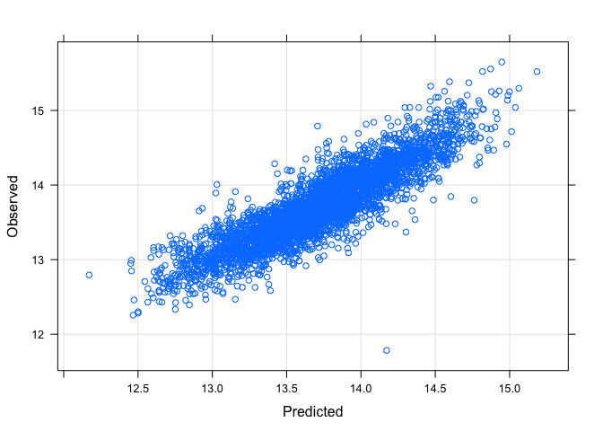
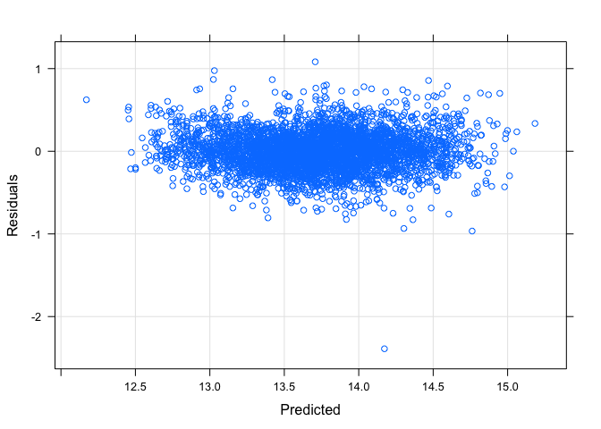
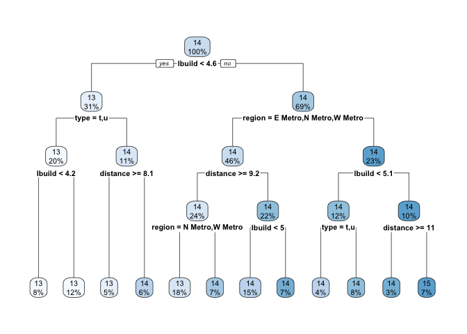
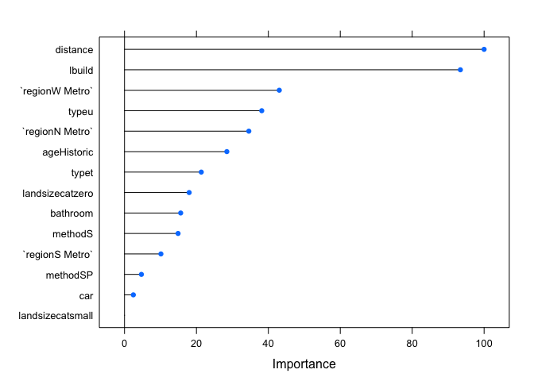

# MelbourneHousePrice

This is a comprehensive Exploratory Data Analysis for [Melbourne Housing Market](https://www.kaggle.com/anthonypino/melbourne-housing-market). 

**The goal** is to find out which features are most predictive of Housing Prices in Melbourne. I will study, clean, and visualise the original data, engineer new features, and compare models among `Linear Regression`, `Regression Tree` and `Random Forest` to identify which model produce the lowest RMSE. 

**Variables**

* Price: Price in dollars
* Method: 
      S - property sold
      SP - property sold prior
      PI - property passed in
      PN - sold prior not disclosed
      SN - sold not disclosed
      VB - vendor bid
      W - withdrawn prior to auction
      SA - sold after auction
      SS - sold after auction price not disclosed
* Type: 
      h - house,cottage,villa,semi,terrace
      u - unit, duplex
      t - townhouse
* SellerG: Real Estate Agent
* Date: Date sold
* Distance: Distance from CBD
* Regionname: General Region(West, North West, North, North East..etc)
* Propertycount: Number of properties that exist in the suburb
* Bedroom2: Scraped # of Bedrooms (from different source)
* Car: Number of carspots
* BuildingArea: Building size
* CouncilArea: Governing council for the area

**Outcome variable**: `Price`

Price is heavily right skewed, with median at around 900k.

**Linear Regression model**

I will use 10-fold cross validation (each fold will be about 3618 instances for training and 403 instances for testing) with 3 repeats to estimate the variability of my model. 

Checking `Residual vs Predicted` and `Observed vs Predicted` for model assumption, it seems that linear regression fit the data pretty wll. Cross validation for training indicate RMSE of 0.2379, R-squared of 0.7878 while test set RMSE is 0.2440, R-squared 0.7835.

**Regression Tree**

Test set RMSE associated with regression tree is: 0.3033, which is slightly higher than linear regression model.

**Variable Importance**

Examining the importance of each variable, building area and distance are the 2 most important variable in predicting price, which plays well to our intuitive knowledge that size and location of the property shape property prices.

**Conclusion**

Even though regression tree is much easier to interpret, linear regression model output the smaller test set RMSE.

