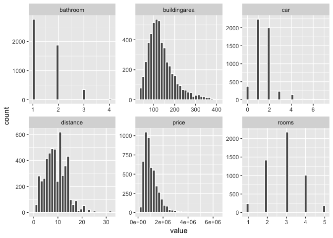
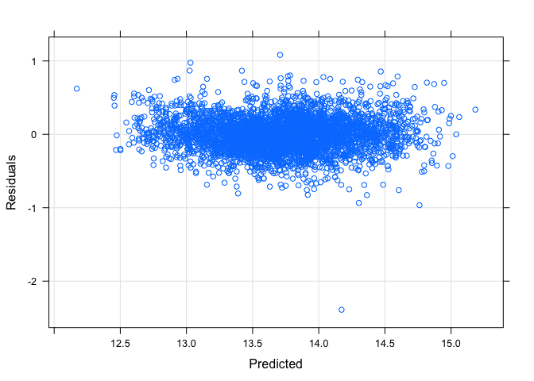
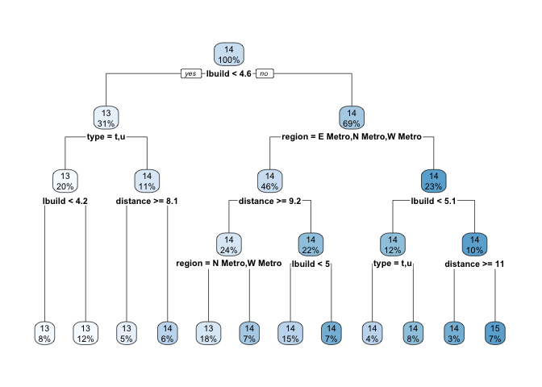
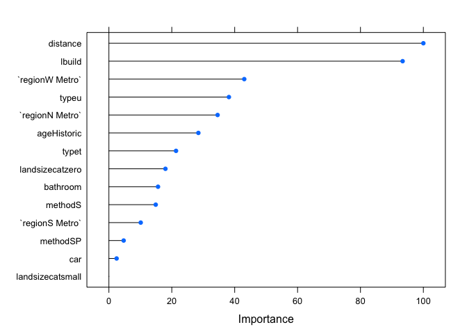

Melbourne housing market
================

Introduction
============

This is a comprehensive Exploratory Data Analysis for [Melbourne Housing Market](https://www.kaggle.com/anthonypino/melbourne-housing-market).

**The goal** is to build a model that predict price of Housing property in Melbourne. I will study, clean, and visualise the original data, engineer new features, and use linear regression to investigates which features are most predictive of the **Price** of the property.

Load Data
=========

``` r
library(tidyverse)
df<- read.csv("melbourne.csv")
colnames(df) <- tolower(colnames(df))

# ignore all NAs for now
df <- na.omit(df)

# delete irrelevant columns I will not use.
df <- df[,-c(1,2,7,8,10,17:19)]
```

Data overview
-------------

There are a lot of outliers for numerical variables, while for categorical variable, there are levels that have very small number of observation.

``` r
glimpse(df)
```

    ## Observations: 6,201
    ## Variables: 13
    ## $ rooms         <int> 2, 3, 4, 3, 2, 2, 3, 2, 2, 3, 3, 2, 4, 2, 2, 2, ...
    ## $ type          <fct> h, h, h, h, h, h, h, u, h, h, h, h, h, u, h, h, ...
    ## $ price         <dbl> 1035000, 1465000, 1600000, 1876000, 1636000, 109...
    ## $ method        <fct> S, SP, VB, S, S, S, VB, S, S, S, S, S, PI, S, PI...
    ## $ distance      <dbl> 2.5, 2.5, 2.5, 2.5, 2.5, 2.5, 2.5, 2.5, 2.5, 2.5...
    ## $ bedroom2      <int> 2, 3, 3, 4, 2, 3, 3, 2, 2, 3, 2, 2, 4, 2, 2, 2, ...
    ## $ bathroom      <int> 1, 2, 1, 2, 1, 1, 2, 2, 1, 2, 1, 1, 2, 1, 2, 1, ...
    ## $ car           <int> 0, 0, 2, 0, 2, 2, 2, 1, 2, 1, 1, 1, 2, 1, 1, 0, ...
    ## $ landsize      <dbl> 156, 134, 120, 245, 256, 220, 214, 0, 238, 113, ...
    ## $ buildingarea  <dbl> 79, 150, 142, 210, 107, 75, 190, 94, 97, 110, 10...
    ## $ yearbuilt     <int> 1900, 1900, 2014, 1910, 1890, 1900, 2005, 2009, ...
    ## $ regionname    <fct> Northern Metropolitan, Northern Metropolitan, No...
    ## $ propertycount <int> 4019, 4019, 4019, 4019, 4019, 4019, 4019, 4019, ...

``` r
summary(df)
```

    ##      rooms       type         price             method    
    ##  Min.   :1.000   h:4093   Min.   : 131000   S      :3961  
    ##  1st Qu.:2.000   t: 602   1st Qu.: 620000   SP     : 898  
    ##  Median :3.000   u:1506   Median : 880000   PI     : 757  
    ##  Mean   :2.932            Mean   :1067881   VB     : 544  
    ##  3rd Qu.:4.000            3rd Qu.:1325000   SA     :  41  
    ##  Max.   :9.000            Max.   :8000000   PN     :   0  
    ##                                             (Other):   0  
    ##     distance         bedroom2        bathroom          car        
    ##  Min.   : 0.000   Min.   :0.000   Min.   :1.000   Min.   : 0.000  
    ##  1st Qu.: 5.900   1st Qu.:2.000   1st Qu.:1.000   1st Qu.: 1.000  
    ##  Median : 9.000   Median :3.000   Median :1.000   Median : 1.000  
    ##  Mean   : 9.754   Mean   :2.903   Mean   :1.577   Mean   : 1.574  
    ##  3rd Qu.:12.400   3rd Qu.:3.000   3rd Qu.:2.000   3rd Qu.: 2.000  
    ##  Max.   :47.400   Max.   :9.000   Max.   :8.000   Max.   :10.000  
    ##                                                                   
    ##     landsize        buildingarea      yearbuilt   
    ##  Min.   :    0.0   Min.   :   0.0   Min.   :1196  
    ##  1st Qu.:  152.0   1st Qu.:  91.0   1st Qu.:1940  
    ##  Median :  373.0   Median : 124.0   Median :1970  
    ##  Mean   :  477.1   Mean   : 141.7   Mean   :1964  
    ##  3rd Qu.:  628.0   3rd Qu.: 170.0   3rd Qu.:2000  
    ##  Max.   :38490.0   Max.   :3112.0   Max.   :2018  
    ##                                                   
    ##                       regionname   propertycount  
    ##  Southern Metropolitan     :2168   Min.   :  389  
    ##  Northern Metropolitan     :1855   1st Qu.: 4385  
    ##  Western Metropolitan      :1392   Median : 6567  
    ##  Eastern Metropolitan      : 572   Mean   : 7434  
    ##  South-Eastern Metropolitan: 157   3rd Qu.:10175  
    ##  Eastern Victoria          :  24   Max.   :21650  
    ##  (Other)                   :  33

Feature engineer
================

1.  Age: the exact year of the property may not be of significant, so let's transform the year built variable to binary age variable, `Historic`: older than 50 years property or `Contemporary`: younger than 50 years property.

2.  Landsize: There are a lot of `zero` value in landsize. These observations may be indicative of `Zero-lot-line` homes-residential real estate, where structure comes very near the edge of the property line. Thus, they are valid. Landsize is heavily right skewed, I will break the continuous variable into categorical variable: `zero` size, `small` size, `medium` and `large`.

``` r
df <- df %>%
  mutate(age = factor(ifelse((2018 - yearbuilt) > 50, "Historic", "Contemporary")))

# landsize: zero lot:
ggplot(df, aes(landsize))+geom_histogram(col="white")
```


``` r
quantile(df$landsize, c(0.01, 0.99))
```

    ##   1%  99% 
    ##    0 2787

``` r
land <- df %>% filter(landsize==0)
land1 <- df %>% filter(landsize>0, landsize <=2787)

ggplot(land1, aes(landsize, color=factor(bathroom)))+
  geom_density()+geom_vline(xintercept = c(430,950))
```


``` r
ggplot(land1, aes(landsize, color=type))+
  geom_density()+geom_vline(xintercept = c(430,950))
```


``` r
df <- df %>%
  mutate(landsizecat = factor(ifelse(landsize==0, "zero", 
                                     ifelse(landsize %in% 1:429, "small",
                                     ifelse(landsize %in% 430:949, "medium",
                                      "large")))))
```

Data cleaning
-------------

1.  Bedroom2 is removed given room specify the same thing.
2.  For categorical variable whose proportion of unique values over sample size is low (&lt;9%), I will drop those levels since severely disproportional levels will affect our model.

Hence, I have drop levels from `Method`, `Region` and `Landsizecat`.

1.  Also, I have deleted the only zero value in buildingarea since it's not possible for property to have 0 building area.

``` r
# Remove redundant variables:
# Rooms and Bedroom2 both specify the same thing. We will remove one for ease of modeling. Since Bedroom2 had 0 values, we will remove Bedroom2 and keep Room.
roomvsbedroom <- df %>%
  select(rooms, bedroom2) %>%
  mutate(diff = rooms - bedroom2)
summary(roomvsbedroom)
```

    ##      rooms          bedroom2          diff         
    ##  Min.   :1.000   Min.   :0.000   Min.   :-6.00000  
    ##  1st Qu.:2.000   1st Qu.:2.000   1st Qu.: 0.00000  
    ##  Median :3.000   Median :3.000   Median : 0.00000  
    ##  Mean   :2.932   Mean   :2.903   Mean   : 0.02903  
    ##  3rd Qu.:4.000   3rd Qu.:3.000   3rd Qu.: 0.00000  
    ##  Max.   :9.000   Max.   :9.000   Max.   : 4.00000

``` r
df <- df[,-6]

# method:
prop.table(table(df$method))
```

    ## 
    ##          PI          PN           S          SA          SN          SP 
    ## 0.122077084 0.000000000 0.638767941 0.006611837 0.000000000 0.144815352 
    ##          SS          VB           W 
    ## 0.000000000 0.087727786 0.000000000

``` r
df <- df %>%
  filter(method %in% c("PI", "S", "SP"))
df$method <- droplevels(df$method)

# region:
prop.table(table(df$regionname))
```

    ## 
    ##       Eastern Metropolitan           Eastern Victoria 
    ##                0.092414530                0.003917379 
    ##      Northern Metropolitan          Northern Victoria 
    ##                0.305555556                0.003205128 
    ## South-Eastern Metropolitan      Southern Metropolitan 
    ##                0.027243590                0.336716524 
    ##       Western Metropolitan           Western Victoria 
    ##                0.228454416                0.002492877

``` r
df <- df %>%
  filter(regionname %in% c("Eastern Metropolitan", "Northern Metropolitan", 
                       "Southern Metropolitan", "Western Metropolitan"))
df$regionname <- droplevels(df$regionname)

df <- mutate(df, region = fct_recode(regionname,
                                         "E Metro" = "Eastern Metropolitan",
                                         "N Metro" =  "Northern Metropolitan",
                                         "S Metro" = "Southern Metropolitan",
                                         "W Metro" = "Western Metropolitan"))

# landsizecat:
prop.table(table(df$landsizecat))
```

    ## 
    ##     large    medium     small      zero 
    ## 0.0467739 0.4024774 0.3904603 0.1602884

``` r
df <- df %>%
  filter(landsizecat %in% c("medium", "small", "zero"))
df$landsizecat <- droplevels(df$landsizecat)

summary(df)
```

    ##      rooms       type         price         method       distance     
    ##  Min.   :1.000   h:3472   Min.   : 131000   PI: 698   Min.   : 0.000  
    ##  1st Qu.:2.000   t: 521   1st Qu.: 639750   S :3659   1st Qu.: 6.100  
    ##  Median :3.000   u:1163   Median : 891250   SP: 799   Median : 9.000  
    ##  Mean   :2.917            Mean   :1061271             Mean   : 9.339  
    ##  3rd Qu.:3.000            3rd Qu.:1320000             3rd Qu.:12.300  
    ##  Max.   :8.000            Max.   :6250000             Max.   :31.700  
    ##     bathroom          car           landsize      buildingarea   
    ##  Min.   :1.000   Min.   :0.000   Min.   :  0.0   Min.   :   0.0  
    ##  1st Qu.:1.000   1st Qu.:1.000   1st Qu.:145.8   1st Qu.:  93.0  
    ##  Median :1.000   Median :1.000   Median :336.0   Median : 123.0  
    ##  Mean   :1.549   Mean   :1.545   Mean   :365.5   Mean   : 139.9  
    ##  3rd Qu.:2.000   3rd Qu.:2.000   3rd Qu.:598.0   3rd Qu.: 166.0  
    ##  Max.   :6.000   Max.   :7.000   Max.   :948.0   Max.   :3112.0  
    ##    yearbuilt                    regionname   propertycount  
    ##  Min.   :1850   Eastern Metropolitan : 488   Min.   :  389  
    ##  1st Qu.:1940   Northern Metropolitan:1657   1st Qu.: 4442  
    ##  Median :1967   Southern Metropolitan:1769   Median : 6567  
    ##  Mean   :1963   Western Metropolitan :1242   Mean   : 7476  
    ##  3rd Qu.:1999                                3rd Qu.:10331  
    ##  Max.   :2018                                Max.   :21650  
    ##            age       landsizecat       region    
    ##  Contemporary:2576   medium:2177   E Metro: 488  
    ##  Historic    :2580   small :2112   N Metro:1657  
    ##                      zero  : 867   S Metro:1769  
    ##                                    W Metro:1242  
    ##                                                  
    ## 

``` r
df <- df %>% filter(buildingarea>0)
df <- df[,-c(8,10,11,12)]

# Treat outlier:
# Let's keep 98% of the data, getting rid of <1% and > 99%.
quantile(df$buildingarea, c(0.01,0.99))
```

    ##     1%    99% 
    ##  33.54 402.68

``` r
quantile(df$bathroom, 0.99)
```

    ##  99% 
    ## 3.46

``` r
quantile(df$rooms, 0.99)
```

    ## 99% 
    ##   5

``` r
df <- df %>%
  filter(buildingarea <= 403, buildingarea>33,
         bathroom <=4, rooms<=5)
```

Visualization
=============

Univariate variable:
--------------------

All the continuous variables are right skewed.

``` r
df %>%
  keep(is.numeric) %>%
  gather() %>%
  ggplot(aes(value)) +
    facet_wrap(~key, scales='free') +
    geom_histogram(col="white")
```



``` r
df %>%
  keep(is.factor) %>%
  gather() %>%
  ggplot(aes(value)) +
    facet_wrap(~key, scales='free') +
    geom_bar()
```


``` r
library(scales)
options(scipen = 999) 

ggplot(df, aes(price)) + 
  geom_density() + scale_x_continuous(labels = dollar) +
  labs(x = "", y = "", title = "Price distribution")
```


Feature relations
-----------------

I am curious about the following predictors, let's examine their relationship with `Price`.

Log transforming `Buildingarea` and `price` suggest a nice linear relationship. The categorical variable I transform for `landsize` suggest bigger landsize higher median price. For `Region`, Southern metropolitan has the highest median price also most outlier.

``` r
ggplot(df, aes(landsizecat, price)) + geom_boxplot()
```


``` r
ggplot(df, aes(log(buildingarea), log(price))) + 
  geom_point() +
  geom_smooth(method="loess")
```


``` r
ggplot(df, aes(region, price)) + geom_boxplot()
```


Split data into training and testing:
=====================================

``` r
library(caret)
set.seed(7)
validationIndex <- createDataPartition(df$price, p=0.80, list=FALSE)
test <- df[-validationIndex,]
train <- df[validationIndex,]
```

Calculate statistics
--------------------

Let's evaluate continous variables for skewness and transform skew predictor using BoxCox transformation.

From `BoxCoxTrans()` function, it recommends us to log transform price and the estimated lambda for buildingarea is 0.1, it's close to 0, so I will log transform it as well.

``` r
# calculate skewness
library(e1071)
(skew <- apply(train[,-c(2,4,9:11)],2,skewness))
```

    ##        rooms        price     distance     bathroom          car 
    ##    0.1008022    2.0276992    0.7163415    0.9877431    1.1415170 
    ## buildingarea 
    ##    1.1810478

``` r
# find appropriate transformation
BoxCoxTrans(train$price)
```

    ## Box-Cox Transformation
    ## 
    ## 4021 data points used to estimate Lambda
    ## 
    ## Input data summary:
    ##    Min. 1st Qu.  Median    Mean 3rd Qu.    Max. 
    ##  131000  636500  890000 1050526 1310000 6250000 
    ## 
    ## Largest/Smallest: 47.7 
    ## Sample Skewness: 2.03 
    ## 
    ## Estimated Lambda: -0.1 
    ## With fudge factor, Lambda = 0 will be used for transformations

``` r
BoxCoxTrans(train$buildingarea)
```

    ## Box-Cox Transformation
    ## 
    ## 4021 data points used to estimate Lambda
    ## 
    ## Input data summary:
    ##    Min. 1st Qu.  Median    Mean 3rd Qu.    Max. 
    ##    34.0    93.0   122.0   135.4   163.0   399.0 
    ## 
    ## Largest/Smallest: 11.7 
    ## Sample Skewness: 1.18 
    ## 
    ## Estimated Lambda: 0 
    ## With fudge factor, Lambda = 0 will be used for transformations

Correlation
===========

-   Price is correlated most with buildingarea, room, bathroom, then type. Rooms is positively correlated with many other predictors.

``` r
cor <- train
cor$landsizecat <- recode_factor(cor$landsizecat, 'zero' = "0", 'small' = "1", 
                                 'medium' = "2")
cor$landsizecat <- as.numeric(as.character(cor$landsizecat))
cols <- c("type", "method", "region", "age")
cor[cols] <- lapply(cor[cols], as.numeric)

library(corrplot)
```

    ## corrplot 0.84 loaded

``` r
cor %>%
  select(price, everything()) %>%
  cor(method = "pearson") %>%
  corrplot(type = "lower", method = "number", diag = FALSE)
```


From `Applied predictive modeling` book, a more heuristic approach to dealing with correlation is to remove minimum number of predictors to ensure all pairwise correlation are below a certain threshold. This method only identify collinearity in 2 dimensions, but it can have significant positive effect on performance of models.

All pairwise correlation should be below 0.7. Two predictors with the largest absolute pairwise correlation are `Rooms` and `Buildingarea`. Let's calculate the average correlation for each predictor with other predictors and remove the one with largest average correlation.

Given `Rooms` has the largest average correlation, let's remove it.

``` r
# predictor A and B, rooms and buildingarea
# find average correlation between A and other variable
# find average correlation between B and other variable:
a <- c(0.55,0.08,0.29,0.58,0.41,0.75,0.09,0.56)
b <- c(0.75,0.48,0.11,0.22,0.68,0.4,0.51,0.06)
sum(a)/8
```

    ## [1] 0.41375

``` r
sum(b)/8
```

    ## [1] 0.40125

Final model:
============

``` r
trainTrans <- train %>%
  mutate(lprice = log(price),
         lbuild = log(buildingarea)) %>%
  select(-c("rooms", "price", "buildingarea"))
```

Model building
==============

I will compare linear regression model with a regression tree model to see which performs better.

Linear regression
-----------------

I will use 10-fold cross validation (each fold will be about 3618 instances for training and 403 instances for testing) with 3 repeats to estimate the variability of my model. RMSE and R^2 metrics will be used to evaluate algorithm. RMSE will give idea of how wrong all predictions are (0 being perfect) and R^2 will give an idea of how well the model fit the data (1 being perfect, 0 being worst.)

Cross validation for linear regression model indicate RMSE of 0.2379, R-squared of 0.7878.

For models built to explain, it's important to check model assumptions, such as residual distribution. We can look at `Residual vs Predicted` values for the model, if the plot shows a random cloud of points, we will feel more comfortable that there are no major terms missing from the model. Another plot to look at is `Observed vs Predicted` to assess how close the prediction are to the actual values.

`Residual vs Predicted` plot shows the residual randomly scattered about 0 with respect to predicted value while the points in `Observed vs Predicted` is close to a regressed diagonal line which indicate linear regression model is a good fit.

Test set RMSE is 0.2440, R-squared 0.7835.

``` r
ctrl <- trainControl(method="repeatedcv", number=10, repeats=3)
metric <- "RMSE"

# Linear regression
set.seed(100)
lm1 <- train(lprice~., data=trainTrans, method="lm", metric= metric, trControl=ctrl)
lm1
```

    ## Linear Regression 
    ## 
    ## 4021 samples
    ##    9 predictor
    ## 
    ## No pre-processing
    ## Resampling: Cross-Validated (10 fold, repeated 3 times) 
    ## Summary of sample sizes: 3620, 3619, 3618, 3618, 3620, 3619, ... 
    ## Resampling results:
    ## 
    ##   RMSE       Rsquared   MAE      
    ##   0.2380379  0.7876753  0.1824841
    ## 
    ## Tuning parameter 'intercept' was held constant at a value of TRUE

``` r
# regression diagnostic:
xyplot(trainTrans$lprice ~ predict(lm1),
       type=c("p", "g"),
       xlab="Predicted", ylab="Observed")
```


``` r
xyplot(resid(lm1) ~ predict(lm1),
       type=c("p", "g"),
       xlab="Predicted", ylab="Residuals")
```



``` r
# Predict on test set:
testTrans <- test %>%
  mutate(lprice = log(price),
         lbuild = log(buildingarea)) %>%
  select(-c("rooms", "price", "buildingarea"))

lmpred <- predict(lm1,testTrans)
postResample(pred=lmpred, obs=testTrans$lprice)
```

    ##      RMSE  Rsquared       MAE 
    ## 0.2440223 0.7835239 0.1846987

Regression tree
---------------

Regression tree partition a data set into smaller groups and then fit a simple model for each subgroup. Advantage of using regression tree compared to linear regression is that it's easier to explain the result compare to linear regression.

The top split assigns observation having log(buildingarea) \[buildingarea of the property\] smaller than 4.6, which is approximately 1076 square foot property to the left, the predicted price for property who is either a `Townhouse` or `Unit` with buildingarea &lt; 718 square foot cost around $423,064.

If the property is greater than 1076 square foot, and it's in Northern Metropolitan or Western Metropolitan area with distance &gt; 9.2, its predicted price is 698,807.

Test set RMSE associated with regression tree is: 0.3033, which is slightly higher than linear regression model.

``` r
library(rpart)
library(rpart.plot)

# method ="anova" specifying fitting regression tree.
tree1 <- rpart(lprice~., trainTrans, method="anova")
tree1
```

    ## n= 4021 
    ## 
    ## node), split, n, deviance, yval
    ##       * denotes terminal node
    ## 
    ##  1) root 4021 1070.866000 13.72785  
    ##    2) lbuild< 4.613136 1247  192.171100 13.31791  
    ##      4) type=t,u 808   73.041090 13.14971  
    ##        8) lbuild< 4.2121 333   23.108370 12.95528 *
    ##        9) lbuild>=4.2121 475   28.520370 13.28601 *
    ##      5) type=h 439   54.193120 13.62750  
    ##       10) distance>=8.1 215   21.790180 13.43171 *
    ##       11) distance< 8.1 224   16.250850 13.81542 *
    ##    3) lbuild>=4.613136 2774  574.930200 13.91213  
    ##      6) region=E Metro,N Metro,W Metro 1866  275.200600 13.75157  
    ##       12) distance>=9.15 975  112.990900 13.57345  
    ##         24) region=N Metro,W Metro 706   52.374280 13.45713 *
    ##         25) region=E Metro 269   25.998040 13.87871 *
    ##       13) distance< 9.15 891   97.425800 13.94648  
    ##         26) lbuild< 5.040189 600   45.199770 13.84277 *
    ##         27) lbuild>=5.040189 291   32.465250 14.16032 *
    ##      7) region=S Metro 908  152.754000 14.24211  
    ##       14) lbuild< 5.132849 492   60.852750 14.04685  
    ##         28) type=t,u 152    9.406399 13.80163 *
    ##         29) type=h 340   38.219880 14.15647 *
    ##       15) lbuild>=5.132849 416   50.955920 14.47305  
    ##         30) distance>=11.3 118    8.919545 14.21433 *
    ##         31) distance< 11.3 298   31.010660 14.57549 *

``` r
rpart.plot(tree1) # default print it will show percentage of data that fall to that node and the average sales price for that branch. 
```



``` r
# behind the scene, rpart automatically apply a range of cost complexity to prune the tree. To compare the error for each alpha value, rpart performs a 10 fold CV so that error associated with given alpha value is computed on hold-out validation data. In this example, we find diminishing returns after 12 terminal nodes. 
plotcp(tree1)
```


``` r
tree1$cptable
```

    ##            CP nsplit rel error    xerror       xstd
    ## 1  0.28366251      0 1.0000000 1.0005496 0.02164734
    ## 2  0.13724932      1 0.7163375 0.7256058 0.01636595
    ## 3  0.06063961      2 0.5790882 0.5854592 0.01383014
    ## 4  0.06049675      3 0.5184486 0.5410607 0.01325888
    ## 5  0.03823575      4 0.4579518 0.4613110 0.01198567
    ## 6  0.03232765      5 0.4197161 0.4297068 0.01162935
    ## 7  0.01999537      6 0.3873884 0.3969282 0.01115945
    ## 8  0.01845309      7 0.3673930 0.3771168 0.01097337
    ## 9  0.01508321      8 0.3489400 0.3579805 0.01065338
    ## 10 0.01235119      9 0.3338567 0.3431972 0.01083787
    ## 11 0.01029608     10 0.3215055 0.3346659 0.01076469
    ## 12 0.01000000     11 0.3112095 0.3247341 0.01057017

``` r
# make prediction
treepred <- predict(tree1, testTrans)
RMSE(pred = treepred, obs = testTrans$lprice)
```

    ## [1] 0.3033587

Variable Importance
-------------------

Finally, let's check which variable is most predictive of price. The predictors with largest average impact to SSE are consider most important. The importance value is relative mean decrease in SSE compare to most important variable (0-100 scale.)

``` r
plot(varImp(lm1))
```



Conclusion:
===========

Examining the importance of each variable, building area and distance are the 2 most important variable in predicting price, which plays well to our intuitive knowledge that size and location of the property shape property prices.

Even though regression tree is much easier to interpret, linear regression model output the smaller test set RMSE.
